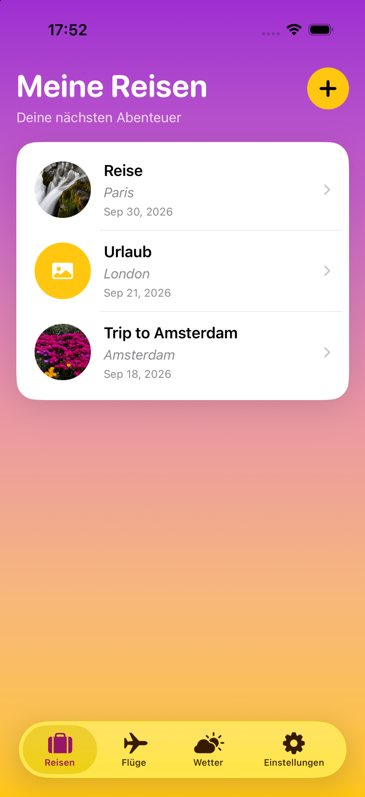
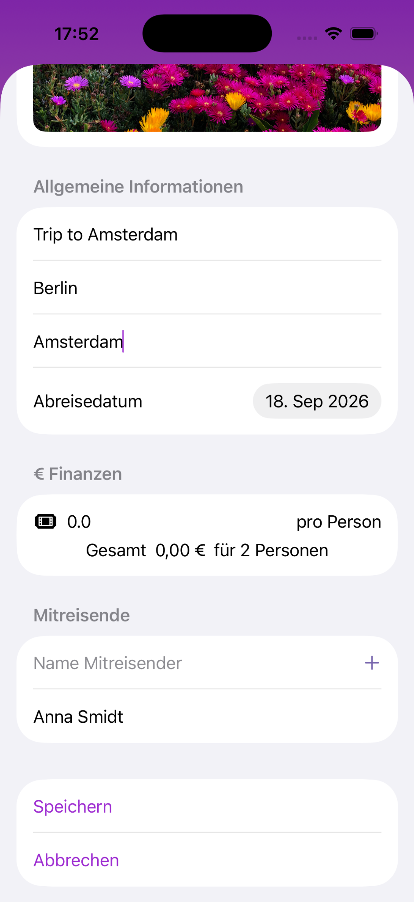
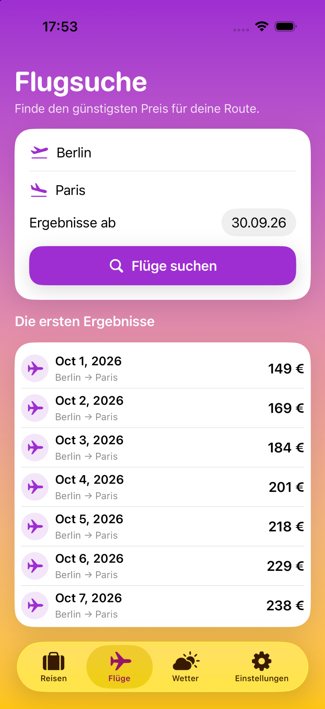
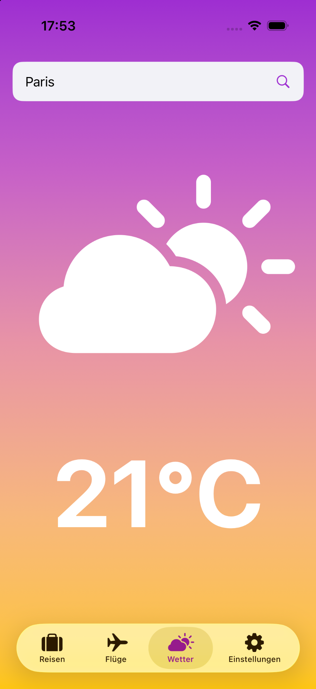
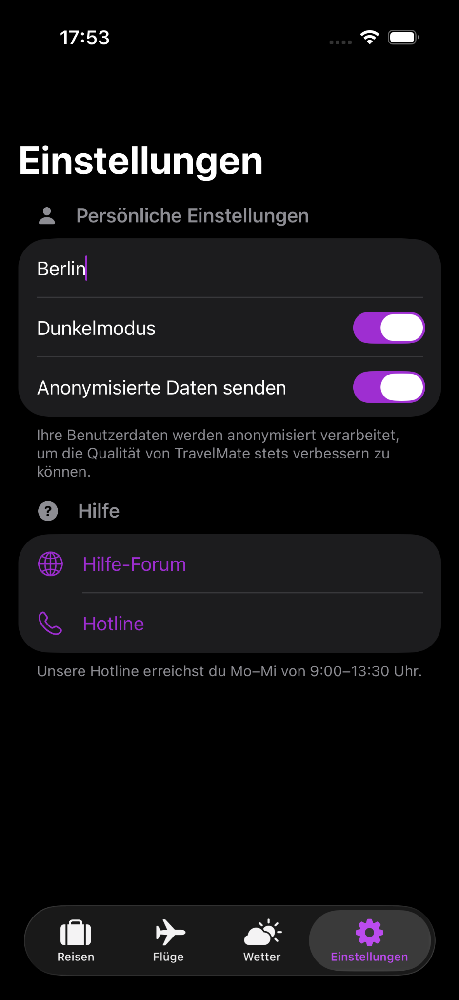
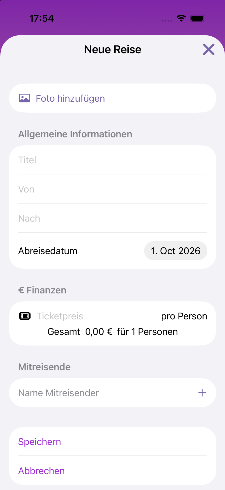
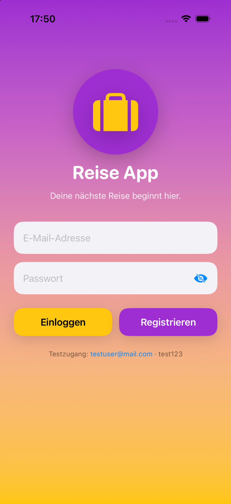
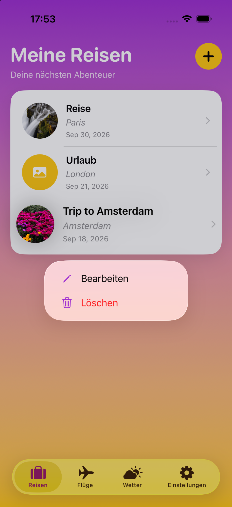

# Reiseapp

A travel planning app built with SwiftUI for managing trips, destinations and flight information.

## Overview

Reiseapp was created as an individual project during my iOS development training.

The application allows users to create and manage travel plans and provides a structured overview of destinations and related flight information.

## Screenshots

  
  
  

  
  
  

  
  

## Technologies

- Swift
- SwiftUI
- SwiftData
- Xcode

## Features

- Create and manage trips
- Store travel destinations
- Store travel dates
- Display flight information
- Persist travel data with SwiftData
- Structured travel overview

## What I Practiced

- Building a larger SwiftUI application
- Working with SwiftData
- Creating and managing data models
- Working with `@Query`
- Managing application state
- Building reusable SwiftUI views
- Structuring a multi-screen application

## Project Structure

The application is organized into separate views and models to keep the code structured and maintainable.

